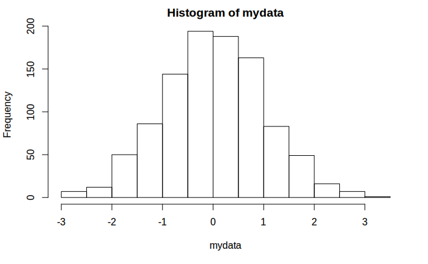

\newpage
\pagenumbering{arabic}

# The plan {-}

 * What is the problem?
 * What to we convert ***to***?
 * How do we get started?


# What is the problem?

<iframe width="560" height="315" src="https://www.youtube-nocookie.com/embed/BsTqEjTIILQ?start=42&rel=0&end=63" frameborder="0" allow="accelerometer; autoplay; encrypted-media; gyroscope; picture-in-picture" allowfullscreen></iframe>

## Could we solve it by...?

You might ask, can we not solve this by ensuring that the PDF is accessible? Unfortunately, the answer is no. The act of creating the PDF destroys information about the structure of the mathematical expression. 

{alt="Jumbled mess of elements of the quadratic equation with the fraction structure and square root structure completely destroyed." width="60%"}

## Computers and maths

* Computers rely on structural integrity to process maths:
  * PDF, print, handwriting and E-books using images of maths cannot be processed. They are inaccessible and inflexible on, for instance, small screen devices. They are lossy formats for maths!
  * Word, HTML based formats and EPub3 have structural integrity for maths and are accessible to many assistive technologies (AT)
  * But not all AT can access maths all formats! PowerPoint 365 is theoretically accessible but most AT won't work with it
* Using a computer with or without assistive technology to write mathematics is a specialist skill!
* Using AT effectively for maths requires authors to produce accessible materials which is challenging due to how mathematicians and scientists typically produce text and documents.

## From retrofitting to inclusive design?

I have spent the last 18 years trying to retrofit accessible interfaces to the entirely natural community evolved handwritten, typeset and old software based maths learning environments. 

It is important to understand that this is a side effect of a more general difficulty - mathematicians continue to hand write and then, maybe, typeset for a reason!

But, we relied on expertise at the intersection of higher level maths, programming and access. Retrofitting is an expensive, inefficient compromise reliant on rare skill sets, research output organically grown tools and, to be honest, serendipity!

## Could we convert the LaTeX?

* It depends on the LaTeX...
* The past: use [tools which may or may not work and that cannot tell you, in general why something doesn't work created and driven by specialists](https://hub.docker.com/r/bathmash/mathaltnotes)
* The future? [lwarp](https://ctan.org/pkg/lwarp?lang=en) but beware of some hard work (documentation currently 1237 pages) - what happens depends on what you are doing in LaTeX and how and you have to work that out and test for accessibility for yourself. 
* It is **not possible** to convert LaTeX to html in the general case. 

## Could we convert the mathematicians?!

Any new document preparation system needs to ***enable*** the writer by providing the key features of mathematical/scientific document preparation. And these features make things complex. 

* Software is catching up and in flux.
* Nothing is easy to learn.

Increasingly we have converted the mathematicians, but they need appropriate institutional infrastructure, support, workload time allocation and training. Without this it is unreasonable.  

# What do we convert ***to***?

From a technical point of view there are only three formats of mathematical text which are accessible:

  * Word
  * HTML using MathJax to render the mathematics
  * EPub3

Supply at least one or, ideally, all (some AT can only access one format, EPub3 has least software support). 

**But** you also need to supply PDF! 

* Not all accessibility is about technical access
* Clear print PDF is selected most often by disabled students in the Department of Mathematical Sciences.

# How do we get started?

## Word 365: Accessibility checker + Equation editor

  * Use the inbuilt Word Accessibility Checker and information on [Making your Word documents accessible](https://support.office.com/en-gb/article/make-your-word-documents-accessible-to-people-with-disabilities-d9bf3683-87ac-47ea-b91a-78dcacb3c66d)
  * Write *all* mathematical text written using the Word 365 equation editor. E.g. if you are writing about the variable \(x\) or \(\theta\) it should be written as an equation. If you are writing \(x^2\) it should be written as an equation.
    * Never use insert symbol.
    * Never write superscripts, subscripts, fractions etc. using font or style changes and standard keyboard input alone
    * Never use an image of an equation.
  * Use Review -> Read Aloud (Alt + Ctrl + Space) to check the maths 

More information and tools within [accessible mathematical Word document workshop resources](https://stem-enable.github.io/WordWorkshop/) and [effective (keyboard-only) input of maths in Word](https://bathmash.github.io/gettingstarted/Word/index.html). 
 
## Sounds solved to me?
 
Some students will require MathType format

* Because their AT vendor has not implemented the interface to Word but the AT does work with MathType. Test everything and contact the vendors!
* Materials should be prepared as above and then a ***copy*** converted to MathType as automatic conversion of all expressions cannot be reversed.

Also... this generally won't work for the mathematicians and some scientists.
 
* Word is not a scientific document preparation system. 
* For those who use LaTeX we need a different plan.

## Web: WCAG 2.1 AA + MathJax!

* Check it meets the legal requirement of WCAG 2.1 Level AA with e.g. [Accessibility Insights for Web plugin for Chrome](https://accessibilityinsights.io/docs/en/web/overview)

* Check it is MathJax... Right click!
\[x = \frac{-b\pm\sqrt{b^2 - 4ac}}{2a}\]

  * Provides/enables: navigation, chunking, zoom, copy/paste, colour, size and layout changes...
  * Structural integrity enables assistive technology including text-to-speech, screenreaders, electronic Braille
  * Fallback for ARIA-aware AT without native support
  * AT providers without native support and not ARIA aware are a problem but not your problem.

## Moodle support throughout!

Moodle enables you to create pages which meet these requirements using LaTeX for the equations. 

**But** Moodle does not provide the necessary features of a mathematical/scientific document preparation system. 

* Web + MathJax is the most accessible end format for a mathematical or scientific document but we need a way to prepare the document 

## Converting the mathematician?

We are not perscriptive but recommend RMarkdown. 

* RMarkdown incorporates LaTeX for equations and a simple markup language for the rest of the document. 
* Authors are confined to a transformable subset with a quick compile loop and a supportive GUI. 
* The output has known accessibility features. 
* The typesetting is still extensible, just more reasonably so.

More information on getting started [RMarkdown workshop resources](https://stem-enable.github.io/RMarkdownWorkshop/)

* [Bookdown](https://bookdown.org/) needed for theorems and intradocument referencing 
* [Clavertondown](https://bathmash.github.io/clavertondown/) for additional functionality important in pure mathematics and for lecturers generally 

# Thanks for listening and watching

* This document is available at [Getting started with accessible maths](https://stem-enable.github.io/Getting-started-with-accessible-maths/index.html)
* My email address is [E.H.Cliffe@bath.ac.uk](mailto:E.H.Cliffe@bath.ac.uk)
* A collection of links to most things I have done related to maths accessibility can be found at [Mathematics accessibility on the Skills Centre: MASH site](https://www.bath.ac.uk/projects/mathematics-accessibility/)

## Mathematical diagrams, software and interactive/dynamic elements including e-assessment

This won't be covered in the talk but is here in case it is useful!

  * Check that the software/system meets WCAG 2.1 level AA - ask the vendor, procure on this basis
    * Be aware that many mathematical and statistical analysis systems are still not accessible
  * Check that mathematics is rendered via MathJax
  * Start to use emerging tools which have known accessibility status for creation of dynamic elements:
    * Desmos, BrailleR, Geogebra (with care)
    * Numbas, Stack
  * If you made a diagram using data or code or some textbased input mechanism then provide that text or link to it somehow.
  * Learn to describe diagrams which can't currently be replaced:
    * DIAGRAM Center (http://diagramcenter.org/):
      * Poet Image Description Training Tool
      * Image description guidelines
      * Sample book
      * Webinar: http://diagramcenter.org/diagramwebinars.html#compleximages
    * UKAAF has guidance on accessible images: https://www.ukaaf.org/accessible-images/
    * NCAM (Old site) has guidelines and examples: http://ncamftp.wgbh.org/ncam-old-site/experience_learn/educational_media/stemdx.html

### Example: Desmos

[Desmos is screenreader accessible and also produces tactile diagrams](https://www.desmos.com/accessibility). If you can redraw the graph in Desmos then do that! 

<iframe src="https://www.desmos.com/calculator/rtvcqeg9ol?embed" width="700px" height="300px" style="border: 1px solid #ccc" frameborder="0">\label{sine}](./desmos-sine-graph.png){width=30% longdesc=https://www.desmos.com/calculator/rtvcqeg9ol}</iframe>


### Example: BrailleR

If you are making some sorts of statistical graphs and you know how to use R (fairly well) then there is a [BrailleR](https://github.com/ajrgodfrey/BrailleR) package which can create descriptions of some sorts of graphs automatically. 

```{r libraries, eval=FALSE, include=FALSE}
library(BrailleR)
```
```{r data, eval=FALSE, include=FALSE}
mydata = rnorm(1000)
```

```{r makeplots, eval=FALSE, include=FALSE}
MakeAccessibleSVG(hist(mydata),file="./Figs/myhist2")
BrowseSVG(file="./Figs/myhist2",dir="./Figs")
pdf('./Figs/myhist2.svg.pdf',width = 4,height=4,paper='special')
hist(mydata)
dev.off()
```

{longdesc=./myhist2.html}

